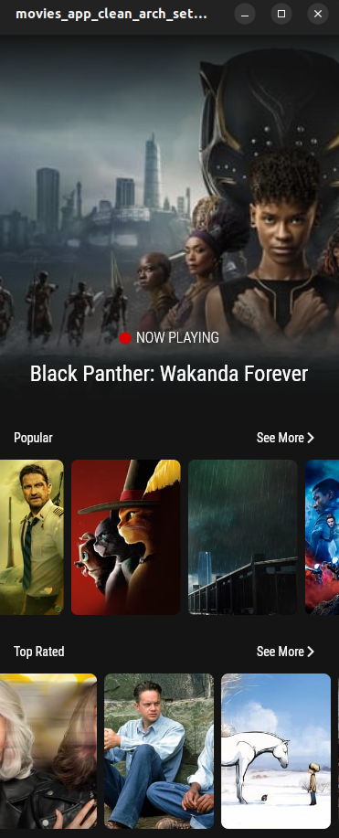

# movies_app_clean_arch_setstate 💙💙
  - Using **setState** Mangement .
  - Using **http** package .
  - Using **Clean Architecture** .

# Map from *list of data* to *dart model* 
 - Using *List<DartModel>.from((data as List).map((e)=> DartModel.fromJson(e),))*
   ```dart
   List<MovieModel> succcessData = List<MovieModel>.from(
     (response.data["results"] as List).map(
       (e) => MovieModel.fromJson(e),
     ),
   );
   return succcessData;
   ```
<p align="center"> OR </p>

- Using *(data as List).map((e)=>DartModel.fromJson(e)).toList*

   ```dart
    List<MovieModel> succcessData = (response.data['results'] as List)
        .map(
          (e) => MovieModel.fromJson(e),
        )
        .toList();
    return succcessData;
   ```
## Add the line in **AndroidManifest.xml**
 - The Path
    /android/app/src/main/AndroidManifest.xml
 - Added Line  
   ```html
       <!--this line is added for internet permission BY:MAHNEYELBANA -->
       <uses-permission android:name="android.permission.INTERNET"/>
       <!--this line is added for internet permission BY:MAHNEYELBANA -->
   ``` 
<p align="center">
  <code>   </code> 
</p>

